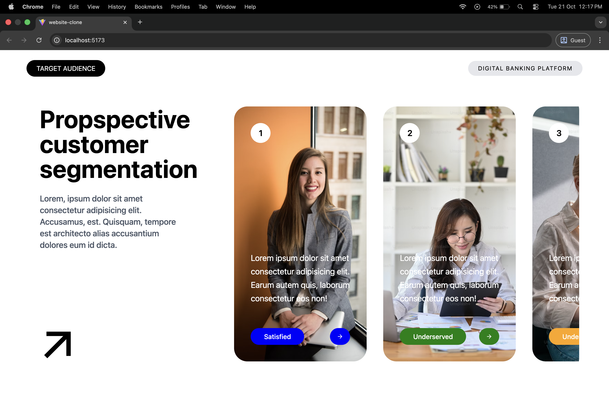

# 🌟 React UI Project

A clean and responsive **React UI** built using **components**, **props**, and **Tailwind CSS**.  
This project focuses on reusable design patterns, simplicity, and fast performance.

---

## 🖼️ Project Preview


*(Ensure the image file `React-Ui.png` is in your main project folder.)*

---

## 🚀 Tech Stack
- ⚛️ **React** – Functional Components & Props  
- 🎨 **Tailwind CSS** – Modern styling  
- ⚡ **Vite** – Lightning-fast build tool  

---

## 💻 Setup
```bash
git clone https://github.com/your-username/react-ui-project.git
cd react-ui-project
npm install
npm run dev
